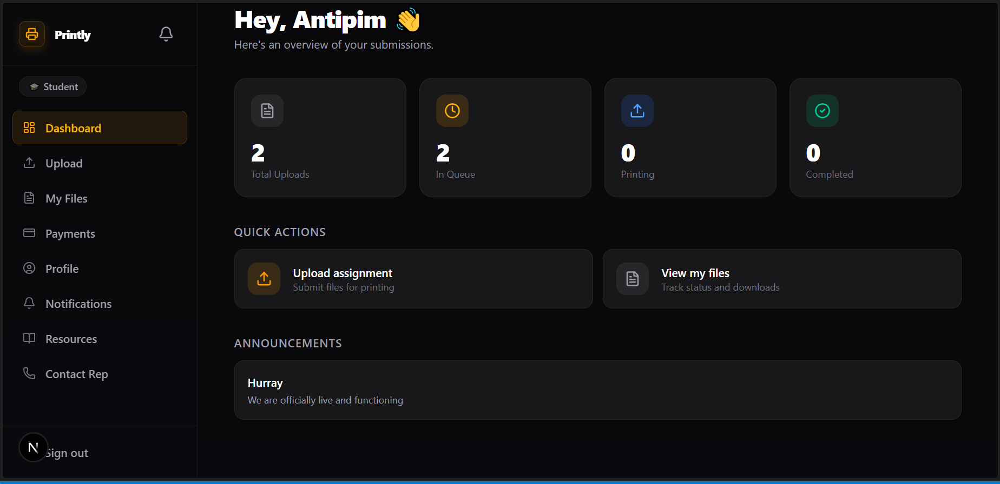
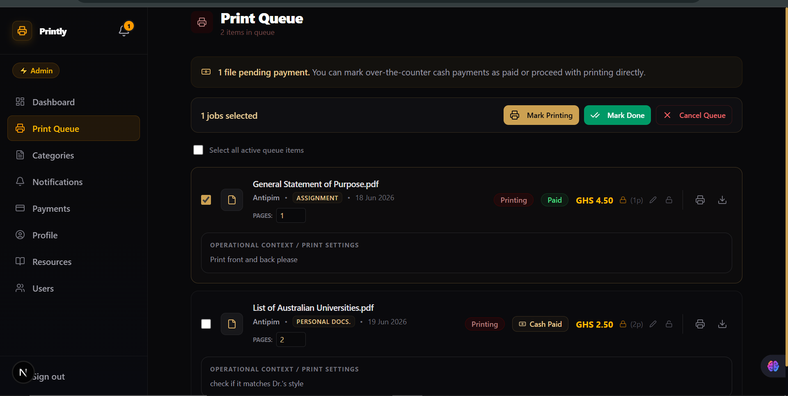
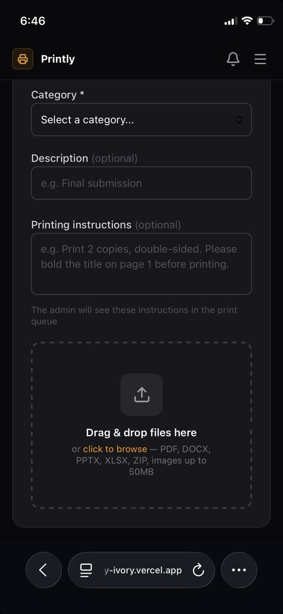
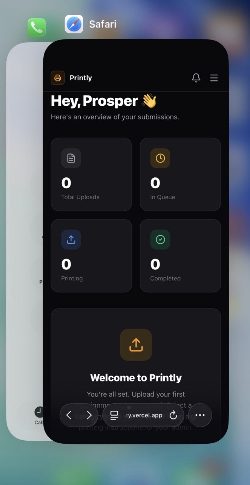

<div align="center">

  <h1>
  🖨️ Printly
  </h1>

  <p><strong>Centralized assignment pipeline and print management for university networks</strong></p>

  
  
  
  
  
  

  <br/>

  <p>
    <a href="https://printly-ivory.vercel.app">Live Demo</a> ·
    <a href="#visual-interface-showcase">UI Showcase</a> ·
    <a href="#features">Features</a> ·
    <a href="#architectural-complexity">System Architecture</a> ·
    <a href="#getting-started">Getting Started</a> ·
    <a href="#database-model--data-isolation">Database Schema</a>
  </p>

  <p>By <a href="https://github.com/CosmosKyeremeh">BonGr8</a></p>

</div>

---

## The Problem

In many university classes across Ghana, students print assignments individually at the campus printer. This creates a severe operational bottleneck:

- **Disorganized Pipelines** — Print managers handle mixed, fragmented file formats manually with no tracking
- **Opacity** — No centralized record of who submitted, who paid, or what has been printed
- **Friction** — Manual cash handling and fragmented communication over WhatsApp and word-of-mouth
- **Deadline Failures** — Reminders sent per person with no broadcast system

This is not a minor UX inconvenience — it is a systemic coordination failure.

## The Solution

Printly transforms chaotic manual processing into a structured, trackable state machine:

```text
Upload ──▶ Queue ──▶ Price ──▶ Pay ──▶ Print ──▶ Notify
```

Students submit once from any device. Admins manage everything — queue, pricing, payments, notifications — from a single dashboard. The system installs as a PWA for instant home-screen access on any phone.

---

## 📱 Visual Interface Showcase

### Desktop Interfaces

<div align="center">
  <p><strong>Student Dashboard View</strong></p>
  
</div>

<div align="center">
  <p><strong>Admin Active Print Queue</strong></p>
  
</div>

### Mobile & Upload Interface

<div align="center">
  <table width="80%" style="border-collapse: collapse; border: none;">
    <tr>
      <td width="50%" align="center" style="border: none; vertical-align: top;">
        <p><strong>Drag &amp; Drop Upload UI</strong></p>
        
      </td>
      <td width="50%" align="center" style="border: none; vertical-align: top;">
        <p><strong>Mobile Edge Optimization</strong></p>
        
      </td>
    </tr>
  </table>
</div>

---

## Features

### For Students

- **File Upload** — Drag and drop multiple files (PDF, DOCX, PPTX, XLSX, ZIP, images up to 50MB)
- **Printing Instructions** — Leave per-file notes for the admin (copies, colour, edits needed)
- **File Conversion** — Convert PDF ↔ DOCX server-side directly in the browser
- **File Management** — View, download, delete uploaded files with live queue position and status
- **Payments** — Pay printing fees via MTN Mobile Money; view full payment history
- **Notifications** — Accordion inbox with unread/read separation; bell resets in real time
- **Resources** — Download templates and materials shared by the admin
- **Contact Rep** — Tap to call, email, or WhatsApp the class rep directly
- **Profile** — Update name, phone, WhatsApp number, and password

### For Admins

- **Print Queue** — Live queue for all submitted files; bulk select, mark printing / done / cancel
- **Pricing Engine** — Auto-calculates GHS 1 per page; manual price override with lock per file
- **Cash Payments** — Mark pending files as cash-paid with one tap; no forced digital payment
- **Direct Print** — Open any file and trigger the browser print dialog from the queue
- **Categories** — Create assignment types with optional deadlines; auto-triggers reminders
- **Notifications** — Broadcast announcements by type (deadline, payment, general, print ready)
- **Resources** — Upload templates and reference files for students to download
- **User Management** — View all users, change roles (student ↔ admin) from within the app
- **Invite Students** — Copy a shareable join-link; students enroll with a class join code

### Platform

- **Multi-tenancy** — Each class is a fully isolated organization with its own join code and data
- **Role Hierarchy** — Superadmin (org creator) → Admin (class rep) → Student
- **PWA** — Installable on iOS and Android; custom install prompt; offline-ready service worker
- **Row Level Security** — All data access enforced at the Postgres engine layer, not just the UI
- **Real-time Bell** — Unread count updates live via Supabase Realtime subscriptions
- **Vercel Analytics + Speed Insights** — Production performance monitoring enabled

---

## Architectural Complexity

Unlike standard CRUD platforms, Printly manages stateful, multi-step workflows that must remain consistent across asynchronous mutations:

1. **State Consistency** — Files move through a strict lifecycle: `queued → printing → done`. Payment status, admin price locks, and print state must remain synchronized across roles and page loads.

2. **Database-Level Authorization** — Access control is not just enforced at the API layer. Postgres Row Level Security isolates every query by `organization_id` at the engine level. Bypassing the UI grants nothing.

3. **Multi-Tenant Isolation** — Every table is scoped by `org_id`. The platform owner (`is_platform_owner = true`) bypasses all scoping via a security-definer helper. Organization admins see only their own data. Students see only their own files.

4. **Trigger-Driven Integrity** — `org_id` is auto-populated on every insert via a `before insert` trigger. Frontend components never need to pass it manually — the database enforces it.

5. **Realtime Coordination** — The notification bell subscribes to `postgres_changes` on the notifications table. Mark-as-read is persisted via a `security definer` RPC function that bypasses RLS safely.

---

## Tech Stack

| Layer | Technology | Purpose |
|-------|-----------|---------|
| Frontend | Next.js 16 (App Router) | Server components, API routes, streaming |
| Language | TypeScript | End-to-end type safety |
| Styling | Tailwind CSS v4 + shadcn/ui | Design system, accessible components |
| Animation | Framer Motion | Page transitions, accordions, micro-interactions |
| Database | Supabase (Postgres) | Relational data with Row Level Security |
| Auth | Supabase Auth | Email/password, role-based routing, org-scoped |
| Storage | Supabase Storage | Per-user private file buckets with signed URLs |
| File Conversion | ConvertAPI | Server-side PDF ↔ DOCX conversion |
| Payments | MTN Mobile Money (Hubtel) | Ghana-local mobile money payments |
| Analytics | Vercel Analytics + Speed Insights | Real user monitoring |
| Deployment | Vercel | CI/CD, preview deployments, edge network |

---

## Getting Started

### Prerequisites

- Node.js v20+
- npm v9+
- Git
- Supabase account
- Vercel account

### Local Development

**1. Clone the repository**

```bash
git clone https://github.com/CosmosKyeremeh/printly.git
cd printly
git checkout develop
```

**2. Install dependencies**

```bash
npm install
```

**3. Set up environment variables**

```bash
cp .env.example .env.local
```

Fill in your `.env.local`:

```env
# Supabase
NEXT_PUBLIC_SUPABASE_URL=your_supabase_project_url
NEXT_PUBLIC_SUPABASE_ANON_KEY=your_supabase_anon_key
SUPABASE_SERVICE_ROLE_KEY=your_service_role_key

# App
NEXT_PUBLIC_APP_URL=http://localhost:3000

# File Conversion
CONVERT_API_SECRET=your_convertapi_sandbox_token

# Payments
HUBTEL_CLIENT_ID=your_hubtel_client_id
HUBTEL_CLIENT_SECRET=your_hubtel_client_secret
```

**4. Set up Supabase**

```bash
# Install CLI via Scoop (Windows)
scoop bucket add supabase https://github.com/supabase/scoop-bucket.git
scoop install supabase

# Authenticate and link
supabase login
supabase link --project-ref your_project_ref

# Push all migrations
supabase db push
```

**5. Create storage buckets**

In Supabase Dashboard → Storage, create two buckets:

| Name | Visibility |
| ------ | ----------- |
| `assignments` | Private |
| `resources` | Public |

Then run the storage RLS policies from `supabase/migrations/`.

**6. Regenerate TypeScript types**

```bash
supabase gen types typescript --project-id your_project_ref > src/types/supabase.types.ts
```

**7. Start the development server**

```bash
npm run dev
```

Visit `http://localhost:3000`

---

## Database Model & Data Isolation

All tables are locked down using PostgreSQL Row Level Security. Students are partitioned into strict isolated data tenancies. Admins see all data within their organization. The platform owner bypasses all scoping via `is_platform_owner = true`.

| Table | Description | RLS Scope |
| ------- | ------------- | ----------- |
| `organizations` | Schools or classes (multi-tenant root) | Authenticated read; service role write |
| `profiles` | Extends `auth.users` — role, org, phone, WhatsApp | Owner read/update; admin read org-wide |
| `categories` | Admin-defined assignment types with optional deadlines | Org-scoped read; admin write |
| `files` | Uploaded assets — status, payment, page count, price | Owner read/write; admin read/update org-wide |
| `print_queue` | Atomic state tracker per file upload | Owner read; admin full access org-wide |
| `payments` | Transaction registry (MoMo provider) | Owner read; admin read org-wide |
| `notifications` | Broadcast announcements with per-user read tracking | Org-scoped read; admin write/delete; members update `read_by` |
| `admin_resources` | Templates and reference files for students | Org-scoped read; admin write |
| `file_comments` | Per-file thread between student and admin | Owner read/write; admin manage |

---

## Multi-Tenancy Model

```
Organization (class / school)
    ├── Superadmin  — creates the org; receives join code to share
    ├── Admin       — class rep; manages queue, payments, notifications
    └── Student     — uploads files; tracks status; makes payments
```

**First-user flow:** When no organization exists, the signup page renders an org creation form. The first user becomes superadmin automatically.

**Student join flow:** Students enter the join code at signup → validated server-side → `org_id` is attached to their profile via Postgres trigger → all their data is automatically scoped to that organization.

---

## Project Structure

```
src/
├── app/
│   ├── (admin)/admin/     # Dashboard, queue, categories, notifications,
│   │                      # payments, resources, users, profile
│   ├── (auth)/            # Login, signup (org-aware), forgot/reset password
│   ├── (student)/         # Dashboard, upload, files, payments, notifications,
│   │                      # resources, contact, profile
│   ├── api/               # organizations/, notifications/, payments/,
│   │                      # files/, queue/, auth/
│   ├── auth/              # Email confirmation callback
│   ├── register/          # Organization self-registration
│   ├── manifest.ts        # PWA manifest
│   └── page.tsx           # Public landing page
├── components/
│   ├── admin/             # PrintQueue, CategoryManager, NotificationForm,
│   │                      # ResourceManager, UserRoleManager, PriceEditor,
│   │                      # InviteStudents, DeadlinePrompt, PaymentOverview
│   ├── auth/              # SignupForm (org-aware client component)
│   ├── shared/            # Navbar, NotificationBell, ProfileForm,
│   │                      # StatusBadge, PageSkeleton, PWAInstallPrompt,
│   │                      # ServiceWorkerRegistration
│   ├── student/           # UploadZone, FileList, ConvertButton,
│   │                      # PaystackPaymentModal, PaymentsList,
│   │                      # NotificationAccordion, ResourceDownloadButton,
│   │                      # MarkNotificationsRead
│   └── ui/                # shadcn/ui base components
├── config/
│   ├── constants.ts       # File limits, status enums
│   └── site.ts            # App name, URL, version
├── lib/
│   ├── conversion/        # ConvertAPI wrapper
│   └── supabase/          # Browser client, server client
├── types/
│   └── supabase.types.ts  # Generated from DB schema
├── proxy.ts               # Route protection (Next.js 16)
└── utils.ts               # formatBytes, formatDate (UTC-stable)

public/
├── favicon_io/            # PWA icons
├── images/school/         # UI screenshots for README
└── sw.js                  # Service worker

supabase/
└── migrations/            # Versioned SQL migration files
```

---

## Authentication & Authorization

| Role | Scope |
| ------ | ------- |
| Platform Owner | `is_platform_owner = true`; bypasses all org scoping; global access |
| Admin | Org-scoped; manages queue, categories, notifications, resources, users |
| Student | Org-scoped; owns only their uploaded files and payments |

Route protection is enforced in `proxy.ts`. All database access is additionally enforced by Supabase RLS — bypassing the UI grants nothing.

---

## Git Flow

```
main          ← production only (tagged releases)
develop       ← default integration branch
feature/*     ← new work, branched from develop
release/*     ← version preparation
hotfix/*      ← emergency production fixes
```

**Commit convention:**

```bash
feat(queue): add bulk status update with optimistic UI
fix(auth): org_id not attached to profile on signup
chore: bump version to 0.3.0
docs: update README with multi-tenancy model
```

**Release cycle:**

```bash
git checkout -b release/vX.X.X
npm version minor --no-git-tag-version
git commit -m "chore: bump version to X.X.X"
git checkout main && git merge release/vX.X.X --no-ff
git tag -a vX.X.X -m "Release vX.X.X"
git push origin main --tags
git checkout develop && git merge main --no-ff && git push
```

---

## Deployment

Deployed on Vercel. Pushes to `main` trigger automatic production deployments.

**Required Vercel environment variables:**

```env
NEXT_PUBLIC_SUPABASE_URL
NEXT_PUBLIC_SUPABASE_ANON_KEY
SUPABASE_SERVICE_ROLE_KEY
NEXT_PUBLIC_APP_URL
CONVERT_API_SECRET
HUBTEL_CLIENT_ID
HUBTEL_CLIENT_SECRET
```

---

## Roadmap

### v0.2 — Real Payments

- [ ] Live Hubtel MoMo API integration (replace demo flow)
- [ ] Payment webhooks with automatic status updates
- [ ] PDF receipt generation and email delivery via Resend

### v0.3 — Notifications

- [ ] Transactional email (print ready, payment confirmed)
- [ ] Automatic deadline reminders via Vercel Cron
- [ ] SMS receipts via Hubtel SMS API

### v0.4 — Polish

- [ ] In-browser PDF preview
- [ ] PDF page counter (auto price calculation)
- [ ] Bulk ZIP download for admin
- [ ] Submission analytics charts

### v1.0 — Scale

- [ ] Multiple org management for platform superadmin dashboard
- [ ] Lecturer account type (create categories, view course submissions)
- [ ] Flutter mobile app (iOS + Android)
- [ ] Direct printer integration via IPP protocol

---

## Security Posture

| Concern | Status |
| --------- | -------- |
| RLS on all tables | ✅ Enforced at DB engine level |
| Org-scoped data isolation | ✅ Every query filtered by `org_id` via trigger + RLS |
| Service role key server-only | ✅ Never exposed client-side |
| Payment status updates | ✅ Server-side API route only |
| Auth rate limiting | ✅ Configured in Supabase dashboard |
| `custom_access_token_hook` | ✅ Removed — not used |
| Admin code exposure | ✅ Server-only env var (`ADMIN_CODE`, not `NEXT_PUBLIC_`) |

---

## Contributing

1. Fork the repository
2. Create a feature branch from `develop`: `git checkout -b feature/your-feature`
3. Commit with conventional commits: `feat(area): description`
4. Push and open a PR targeting `develop`
5. Ensure CI passes before requesting review

---

## License

MIT — see [LICENSE](LICENSE) for details.
